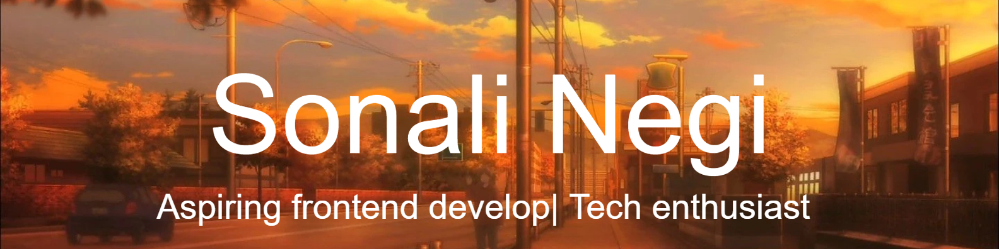

:wave: Hi there! I'm a passionate Frontend Developer in the making, currently pursuing my Bachelor's in Computer Applications (BCA). My journey into the world of coding started with curiosity and has now evolved into a strong passion for crafting beautiful and user-friendly web experiences.

<h2 dir="auto"></h2>
 

- :mortar_board: Currently pursuing BCA (Bachelor of Computer Applications)
- :briefcase: Actively seeking internships and opportunities to grow as a frontend developer
- :seedling: Always learning and exploring new technologies
- :rocket: Passionate about creating responsive and user-friendly web experiences
- :mag: Take a look at my projects on [Frontend Mentor!](https://www.frontendmentor.io/profile/SONALI-NEGI).

<h2 align="center" class="heading-element" dir="auto">:books: Currently Learning</h2>

- Advanced React concepts
- UI/UX design principles
- Backend technologies (Node.js, Express)

<h2 align="center" class="heading-element" dir="auto">:dart: Goals</h2>

- Land a frontend developer internship
- Master React and its ecosystem
- Contribute to impactful projects that make a difference

<h2 align="center" class="heading-element" dir="auto">:family_man_woman_girl_boy: Looking to collaborate on</h2>

- Open-source projects
- Web development projects

<h2 align="center" class="heading-element" dir="auto">:hammer_and_wrench: Languages and Tools</h2>

 

  
 Frontend

   

     &nbsp;
     &nbsp;
     &nbsp;
     &nbsp;
     
  

 

 

  
<b>:computer: Tools</b>

   
  

    &nbsp;
    </a>&nbsp;
    &nbsp;
    &nbsp;
    &nbsp;

 

<h2 dir="auto"></h2>
 

<h2 align="center" class="heading-element" dir="auto">:star2: Let's Bring Your Ideas to Life!</h2>

Are you eager to transform your Figma designs into captivating web experiences? Look no further! I'm here to collaborate with you and turn your vision into a stunning reality. With a blend of creativity and technical expertise, I'll infuse charm and functionality into every project.

Let's turn your ideas into reality!

&nbsp;
&nbsp;

&nbsp;

